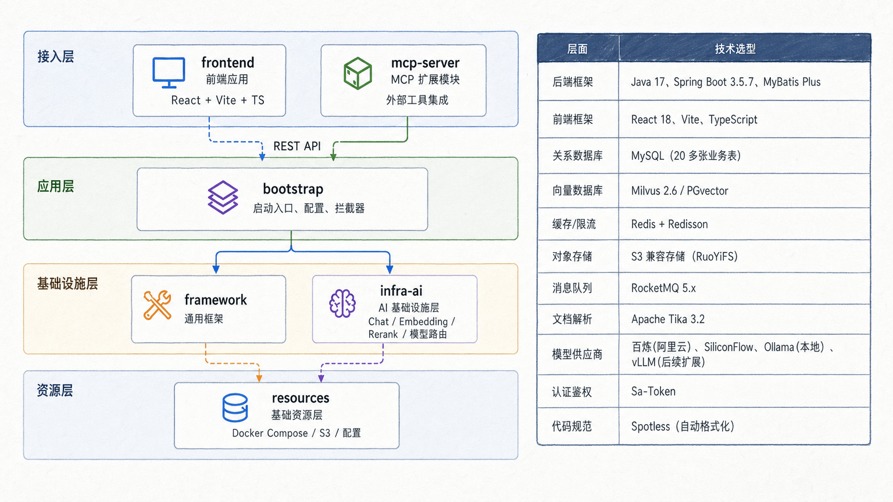

  <strong>RAGone - 企业级 Agentic RAG 平台</strong>

  &nbsp;
  &nbsp;
  &nbsp;
  
  

## 简介

RAGone 是一个企业级 Agentic RAG 平台，覆盖从文档入库到智能问答的完整链路。

- **多路检索**：多渠道并行检索，去重重排兼顾精准与召回
- **意图识别**：树形多级分类，置信度不足时主动引导澄清
- **模型引擎**：多模型路由、首包探测、健康检查、自动熔断降级
- **MCP 集成**：非知识类意图自动提参调用业务工具，检索与工具无缝融合

## 架构

前后端分离，后端按职责分为三个 Maven 模块：

- **framework** — 通用基础设施：异常体系、幂等、分布式 ID、SSE 封装、上下文透传
- **infra-ai** — 屏蔽模型供应商差异，提供统一的 AI 调用抽象
- **bootstrap** — 业务逻辑层，编排 RAG 全链路流程

### 核心链路

一次用户提问的完整处理流程：

### 多路检索

多通道并行检索 + 后处理流水线。各通道通过线程池独立执行，后处理器按序串联精炼结果。

### 模型路由与容错

多供应商路由，首包探测 + 缓冲机制保证切换时用户无感知。三态熔断器（CLOSED → OPEN → HALF_OPEN）独立监控每个模型，配合优先级降级链自动切换。

### 文档入库

基于节点编排的 Pipeline，节点配置持久化到数据库，支持条件执行和输出链式传递，每个任务和节点独立记录执行日志。

### 设计模式

| 设计模式   | 应用场景                                      | 解决的问题                             |
| ---------- | --------------------------------------------- | -------------------------------------- |
| 策略模式   | SearchChannel、PostProcessor、MCPToolExecutor | 组件可插拔替换                        |
| 工厂模式   | IntentTreeFactory、StreamCallbackFactory      | 复杂对象创建集中管理                   |
| 注册表模式 | MCPToolRegistry、IntentNodeRegistry           | 组件自动发现，新增零配置               |
| 模板方法   | IngestionNode 基类                            | 入库节点统一流程，子类只关注核心逻辑   |
| 装饰器模式 | ProbeBufferingCallback                        | 不修改原回调的前提下增加首包探测       |
| 责任链模式 | 后处理器链、模型降级链                        | 多步骤按序串联，灵活组合               |
| 观察者模式 | StreamCallback                                | 流式事件异步通知                       |
| AOP        | @RagTraceNode、@ChatRateLimit                 | 链路追踪、限流与业务代码解耦           |

## 项目规模

| 维度     | 说明                                                        |
| -------- | ----------------------------------------------------------- |
| 后端     | Java ~40,000 行，400+ 源文件                                 |
| 前端     | TypeScript/React ~18,000 行，22 个页面/组件                   |
| 数据库   | 20 张业务表（会话、消息、知识库、文档、分块、意图树、入库流水线、链路追踪、用户） |
| 技术栈   | Spring Boot 3 + React 18 + MySQL + Redis + Elasticsearch     |

## 生产级特性

- **分布式限流**：Redis 信号量 + ZSET + Pub/Sub 实现排队限流，支持全局和用户级控制
- **三态熔断**：模型健康检查 + 失败计数，自动隔离故障模型，冷却后半开探测恢复
- **全链路追踪**：AOP 记录每个环节耗时、输入输出、异常，精确定位问题
- **流式输出**：SSE 实时推送，首包探测保证模型切换用户无感知
- **会话管理**：滑动窗口 + 自动摘要压缩 + TTL 过期
- **认证鉴权**：基于 Sa-Token 的用户认证
- **线程池治理**：8 个专用线程池按工作负载独立配置，TTL 透传用户上下文和 Trace 信息

## 扩展点

核心模块均面向接口编程，新增实现类即可生效，无需修改框架代码：

- **检索通道** — 实现 `SearchChannel` 接口
- **后处理器** — 实现 `SearchResultPostProcessor` 接口
- **MCP 工具** — 实现 `MCPToolExecutor` 接口
- **入库节点** — 实现 `IngestionNode` 接口
- **模型供应商** — 实现 `ChatClient` 接口
