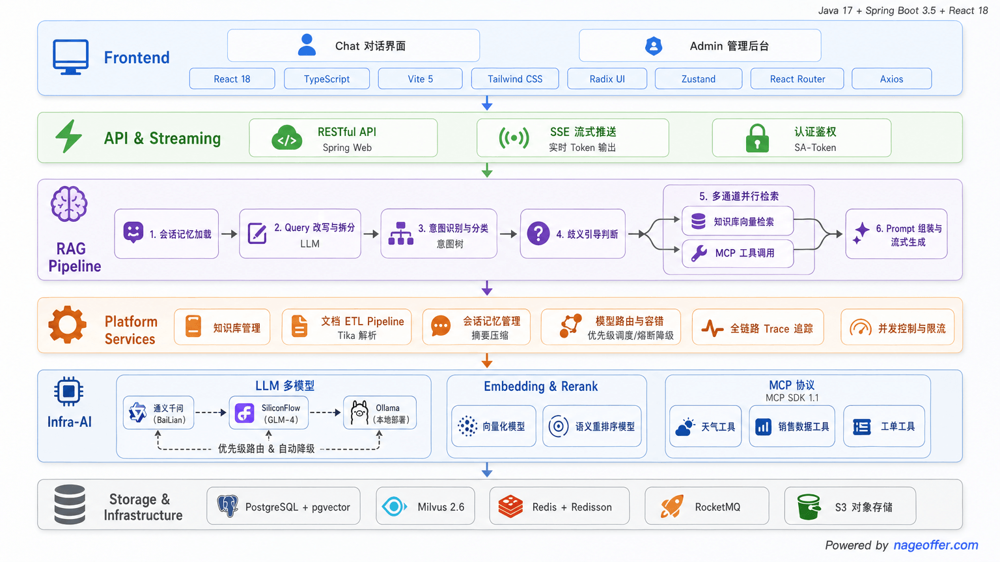
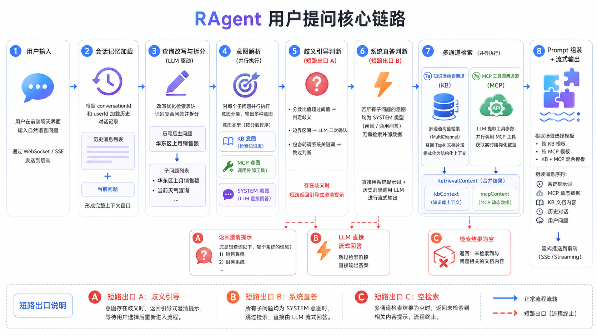
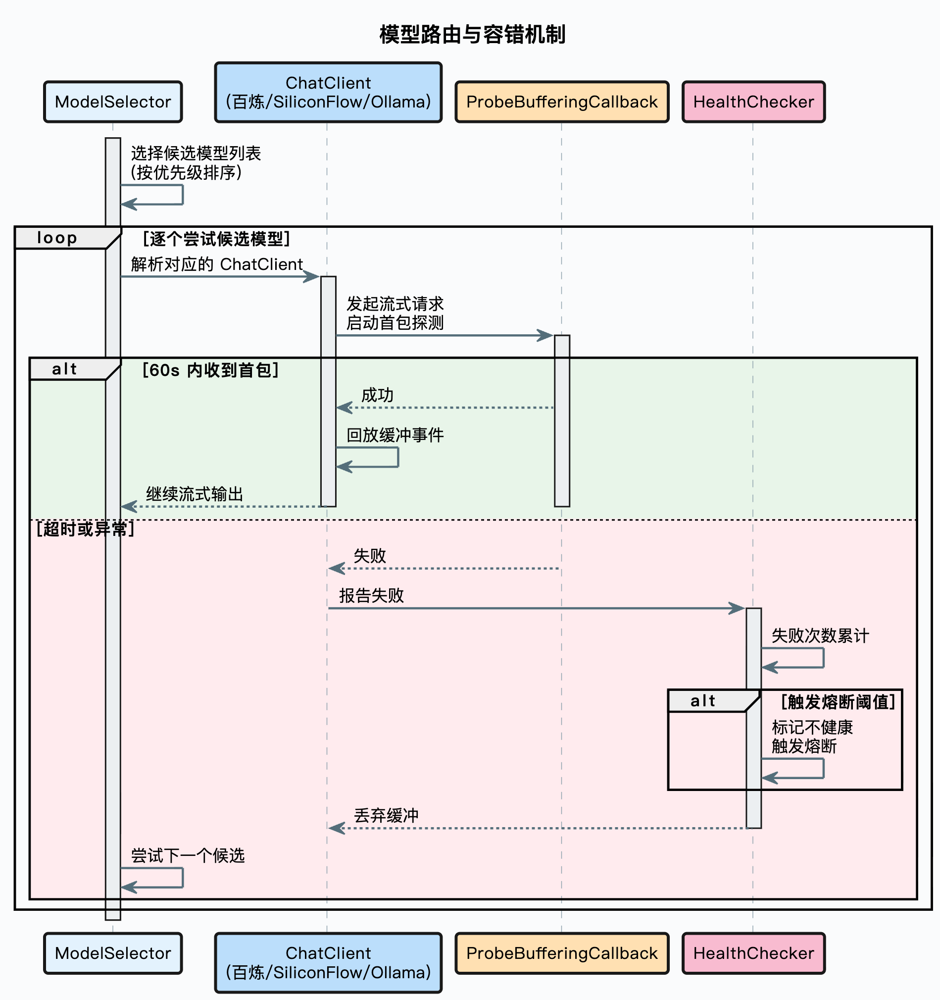

<h1 align="center">
  <strong>🚀 RAGone</strong>
</h1>

<p align="center">
  <strong>企业级 Agentic RAG 平台 | Enterprise-Grade Agentic RAG Platform</strong>
</p>

<p align="center">
  
  
  
  
  
  
  
  
</p>

<p align="center">
  <a href="#-核心特性">核心特性</a> •
  <a href="#-架构设计">架构设计</a> •
  <a href="#-快速开始">快速开始</a> •
  <a href="#-扩展开发">扩展开发</a>
</p>

---

## 📖 简介

RAGone 是一个**企业级 Agentic RAG 平台**，覆盖从文档入库到智能问答的完整链路。

<table>
  <tr>
    <td width="50%">
      <h3>🔍 多路检索</h3>
      多渠道并行检索，去重重排兼顾精准与召回
    </td>
    <td width="50%">
      <h3>🧠 意图识别</h3>
      树形多级分类，置信度不足时主动引导澄清
    </td>
  </tr>
  <tr>
    <td width="50%">
      <h3>⚡ 模型引擎</h3>
      多模型路由、首包探测、健康检查、自动熔断降级
    </td>
    <td width="50%">
      <h3>🔧 MCP 集成</h3>
      非知识类意图自动提参调用业务工具，检索与工具无缝融合
    </td>
  </tr>
</table>

<p align="center">
  
</p>

---

## ✨ 核心特性

<div align="center">

| 特性 | 说明 |
|:---:|:---|
| **🚦 分布式限流** | Redis 信号量 + ZSET + Pub/Sub 实现排队限流，支持全局和用户级控制 |
| **🔴🟡🟢 三态熔断** | 模型健康检查 + 失败计数，自动隔离故障模型，冷却后半开探测恢复 |
| **📊 全链路追踪** | AOP 记录每个环节耗时、输入输出、异常，精确定位问题 |
| **💨 流式输出** | SSE 实时推送，首包探测保证模型切换用户无感知 |
| **💬 会话管理** | 滑动窗口 + 自动摘要压缩 + TTL 过期 |
| **🔐 认证鉴权** | 基于 Sa-Token 的用户认证 |
| **🧵 线程池治理** | 8 个专用线程池按工作负载独立配置，TTL 透传用户上下文和 Trace 信息 |

</div>

---

## 🏗️ 架构设计

### 📦 模块分层

```
┌─────────────────────────────────────────────────────────────────┐
│                          🖥️ Frontend                            │
│                    React 18 + Vite + TypeScript                  │
└─────────────────────────────────────────────────────────────────┘
                              │
                              ▼
┌─────────────────────────────────────────────────────────────────┐
│                        🎯 bootstrap                             │
│               业务逻辑层，编排 RAG 全链路流程                      │
├─────────────────────────────────────────────────────────────────┤
│                        🤖 infra-ai                              │
│              屏蔽模型供应商差异，统一 AI 调用抽象                    │
├─────────────────────────────────────────────────────────────────┤
│                        🧱 framework                             │
│           通用基础设施：异常、幂等、分布式 ID、SSE、上下文透传        │
└─────────────────────────────────────────────────────────────────┘
```

### 🔗 核心链路

<p align="center">
  
</p>

### 🔍 多路检索

<p align="center">
  
</p>

### 🛡️ 模型路由与容错

<p align="center">
  
</p>

### 📐 文档入库

<p align="center">
  
</p>

### 🎨 设计模式

<div align="center">

| 设计模式 | 应用场景 | 解决的问题 |
|:---:|:---|:---|
| **策略模式** | SearchChannel、PostProcessor、MCPToolExecutor | 组件可插拔替换 |
| **工厂模式** | IntentTreeFactory、StreamCallbackFactory | 复杂对象创建集中管理 |
| **注册表模式** | MCPToolRegistry、IntentNodeRegistry | 组件自动发现，新增零配置 |
| **模板方法** | IngestionNode 基类 | 入库节点统一流程，子类只关注核心逻辑 |
| **装饰器模式** | ProbeBufferingCallback | 不修改原回调的前提下增加首包探测 |
| **责任链模式** | 后处理器链、模型降级链 | 多步骤按序串联，灵活组合 |
| **观察者模式** | StreamCallback | 流式事件异步通知 |
| **AOP** | @RagTraceNode、@ChatRateLimit | 链路追踪、限流与业务代码解耦 |

</div>

---

## 🚀 快速开始

### 📋 环境要求

- ☕ **Java 17+**
- 📦 **Node.js 18+**
- 🐳 **Docker & Docker Compose**

### 🐳 一键启动中间件

```bash
# 进入 Docker 配置目录
cd resources/docker

# 🚀 方式 1：仅必须中间件（PostgreSQL + Redis + RocketMQ）
docker compose -f docker-compose-minimal.yaml up -d

# 🚀 方式 2：全部中间件（+ Milvus 向量数据库）
docker compose -f docker-compose-full.yaml up -d
```

**🔌 中间件端口说明**：

| 服务 | 端口 | 说明 |
|:---:|:---:|:---|
| 🐘 PostgreSQL | 5432 | 关系型数据库 + pgvector 向量检索 |
| 🔴 Redis | 6379 | 缓存 + Sa-Token 认证 |
| 🚀 RocketMQ | 9876 | 消息队列 |
| 📊 RocketMQ Dashboard | 8082 | 消息队列管理界面 |
| 🔮 Milvus | 19530 | 向量数据库（full 版本） |
| 🖥️ Attu | 8000 | Milvus 管理界面（full 版本） |

### ⚙️ 启动后端

```bash
# 🔨 构建项目
./mvnw clean install

# 🚀 启动 MCP 服务（端口 9099）
./mvnw spring-boot:run -pl mcp-server

# 🚀 启动主应用（端口 9090）
./mvnw spring-boot:run -pl bootstrap
```

### 🎨 启动前端

```bash
cd frontend
npm install
npm run dev
```

访问 **http://localhost:5173** 开始使用 🎉

---

## 🔧 配置说明

### 🐳 Docker Compose 配置

项目提供两个 Docker Compose 文件：

| 文件 | 用途 | 包含服务 |
|:---|:---|:---|
| `docker-compose-minimal.yaml` | 最小化部署 | PostgreSQL、Redis、RocketMQ |
| `docker-compose-full.yaml` | 完整部署 | 上述 + Milvus、etcd、rustfs、Attu |

### ⚙️ 配置对齐

Docker Compose 配置与 `application.yaml` 完全对齐，无需额外修改：

```yaml
# application.yaml 配置
spring:
  datasource:
    url: jdbc:postgresql://127.0.0.1:5432/ragent
    username: postgres
    password: postgres
  data:
    redis:
      host: 127.0.0.1
      port: 6379
      password: 123456

rocketmq:
  name-server: 127.0.0.1:9876
```

### 🗄️ 数据库初始化

PostgreSQL 容器首次启动时自动执行初始化脚本：

- 📄 `resources/database/schema_pg.sql` → 创建 21 张业务表 + pgvector 扩展
- 📄 `resources/database/init_data_pg.sql` → 初始化管理员账号

### 🔮 向量数据库选择

项目支持两种向量数据库后端：

```yaml
rag:
  vector:
    type: pg      # 🐘 使用 PostgreSQL + pgvector（默认）
    # type: milvus  # 🔮 使用 Milvus
```

### 🤖 AI 模型配置

项目统一使用**阿里云百炼**作为 AI 服务提供商，通过单一 API KEY 即可驱动全部 AI 能力：

| 能力 | 模型 | 说明 |
|:---:|:---|:---|
| 💬 **Chat** | deepseek-v4-flash | DeepSeek 高速对话模型（百炼托管） |
| 📐 **Embedding** | text-embedding-v4 | 文本向量化，最新版本 |
| 🔄 **Rerank** | qwen3-rerank | 检索结果重排序 |

**配置环境变量**：

```bash
export BAILIAN_API_KEY=your_api_key_here
```

**模型配置示例**（`application.yaml`）：

```yaml
ai:
  providers:
    bailian:
      url: https://dashscope.aliyuncs.com
      api-key: ${BAILIAN_API_KEY}
      endpoints:
        chat: /compatible-mode/v1/chat/completions
        embedding: /compatible-mode/v1/embeddings
        rerank: /api/v1/services/rerank/text-rerank/text-rerank

  chat:
    default-model: deepseek-v4-flash
    candidates:
      - id: deepseek-v4-flash
        provider: bailian
        model: deepseek-v4-flash
        priority: 1

  embedding:
    default-model: text-embedding-v4
    candidates:
      - id: text-embedding-v4
        provider: bailian
        model: text-embedding-v4
        dimension: 1536
        priority: 1

  rerank:
    default-model: qwen3-rerank
    candidates:
      - id: qwen3-rerank
        provider: bailian
        model: qwen3-rerank
        priority: 1
```

> 💡 **扩展说明**：如需接入其他兼容 OpenAI 协议的模型服务（如 DeepSeek、MIMO 等），只需新增 `ChatClient` 实现类并添加对应的 provider 配置即可，无需修改框架代码。

---

## 🧩 扩展开发

核心模块均面向接口编程，新增实现类即可生效，无需修改框架代码：

<table>
  <tr>
    <td width="50%">
      <h4>🔍 检索通道</h4>
      <code>SearchChannel</code> 接口<br/>
      实现自定义检索策略
    </td>
    <td width="50%">
      <h4>🔄 后处理器</h4>
      <code>SearchResultPostProcessor</code> 接口<br/>
      实现结果过滤、重排序
    </td>
  </tr>
  <tr>
    <td width="50%">
      <h4>🔧 MCP 工具</h4>
      <code>MCPToolExecutor</code> 接口<br/>
      集成外部业务工具
    </td>
    <td width="50%">
      <h4>📥 入库节点</h4>
      <code>IngestionNode</code> 接口<br/>
      自定义文档处理流程
    </td>
  </tr>
  <tr>
    <td width="50%">
      <h4>🤖 模型供应商</h4>
      <code>ChatClient</code> / <code>EmbeddingClient</code> / <code>RerankClient</code> 接口<br/>
      接入新的 AI 模型
    </td>
    <td width="50%">
      <h4>🌳 意图识别</h4>
      <code>IntentNode</code> 接口<br/>
      扩展意图分类树
    </td>
  </tr>
</table>

---

## 📊 项目规模

<div align="center">

| 维度 | 说明 |
|:---:|:---|
| **☕ 后端** | Java ~40,000 行，400+ 源文件 |
| **🎨 前端** | TypeScript/React ~18,000 行，22 个页面/组件 |
| **🗄️ 数据库** | 20 张业务表 |
| **🛠️ 技术栈** | Spring Boot 3 + React 18 + PostgreSQL + Redis + RocketMQ |

</div>

---

<div align="center">

**Made with ❤️ by RAGone Team**

</div>
